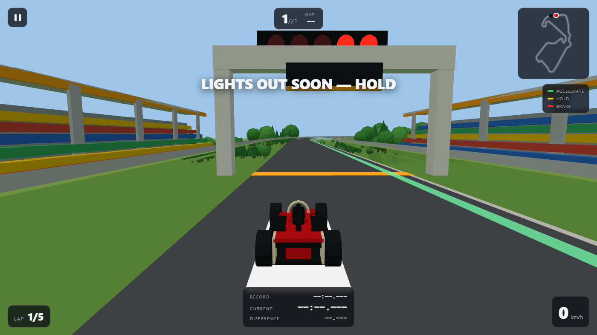
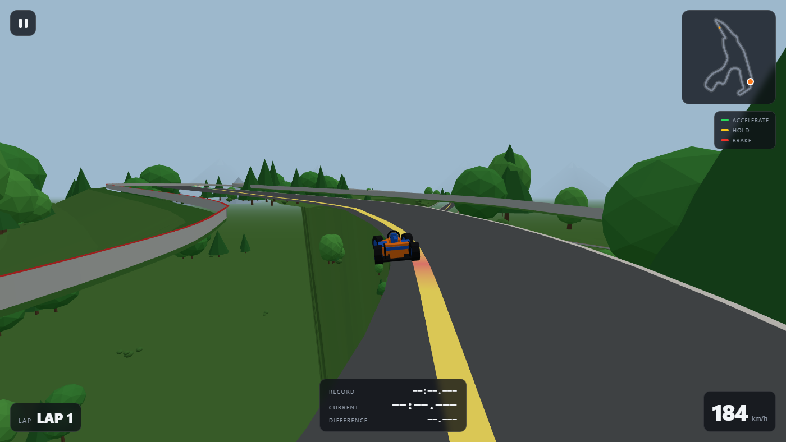
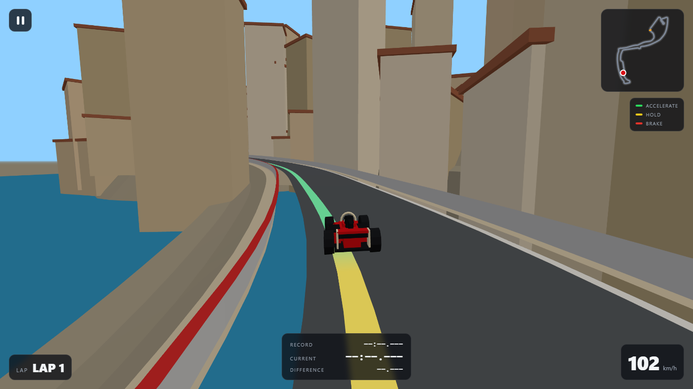
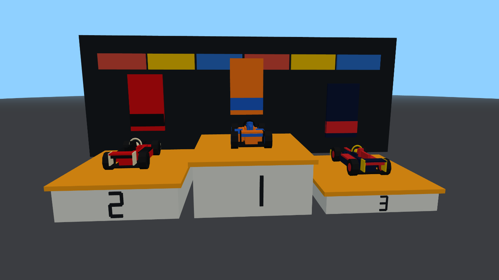
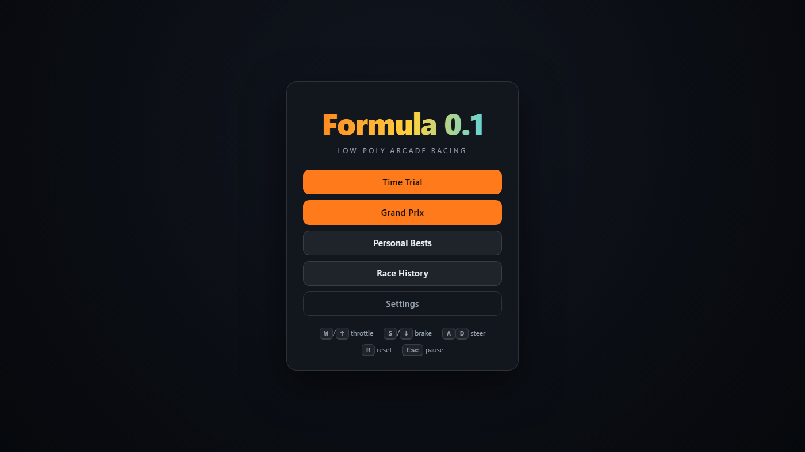

# Formula 0.1

**A low-poly arcade F1 racer that runs in a browser tab.** Three.js and vanilla
JavaScript — no build step, no bundler, no backend, no accounts. Clone it, serve
the folder, drive.

### ▶ [**Play it here**](https://adiiiiiiiiiiithegoat.github.io/formula-0.1/)



Seven real Grand Prix circuits at **1:1 scale**, built from surveyed OpenStreetMap
centrelines rather than drawn by hand — every lap length lands within 0.25% of the
official figure, and the Hard AI laps within **2.6% of real pole time** on average.

---

## Contents

- [Features](#features)
- [Screenshots](#screenshots)
- [Controls](#controls)
- [Running it locally](#running-it-locally)
- [The circuits](#the-circuits)
- [How the circuit data was built](#how-the-circuit-data-was-built)
- [Project layout](#project-layout)
- [Design notes](#design-notes)
- [Licence and credits](#licence-and-credits)

---

## Features

**Two modes.**

- **Time Trial** — team → circuit → drive. Your best lap per circuit is saved, and
  the timing panel shows Record / Current / Difference with a live delta against
  your personal best.
- **Grand Prix** — team → circuit → 3/5/10 laps → Easy/Medium/Hard, then a full
  weekend: Free Practice (skippable) → Qualifying → lights out → race → results →
  podium.

**A qualifying session with a live ghost.** One flying lap. A translucent ghost car
drives whichever lap is currently fastest and re-targets the moment an AI beats it.
The grid is set on lap time, you included.

**A proper lights-out start.** Five red lights come on one at a time, then all go
out together after a random delay. Touch the throttle early and it's a jump start —
you go, but you carry a +5 s penalty to the flag.

**A speed-reactive racing line,** the way the F1 games do it: **green** where you
have room to accelerate, **amber** where the corner ahead won't take much more than
you're already carrying, **red** once you're past the point where you could still
slow down for it. It recolours every frame from your actual speed.

**A live minimap** showing the real circuit outline, the start line, and every car
on track.

**Twenty AI cars that actually race.** Pure-pursuit lookahead steering, braking
computed from upcoming curvature, and basic attack/defend racecraft. Difficulty is
a flat pace baseline applied uniformly — **no rubber-banding**, ever.

**Eleven liveries** from the 2026 grid, approximated in colour only — no logos, no
sponsor marks. Team choice is **purely cosmetic**: every car on the grid, player and
AI alike, runs the identical physics block.

**Procedural engine audio** synthesised with the Web Audio API — oscillators whose
pitch tracks an RPM model through eight gears, not a looped sample.

Everything persists in `localStorage`: best laps, recent race results, settings.

## Screenshots

| | |
|---|---|
|  <br> **Spa** — 6996 m, 101 m of real elevation |  <br> **Monaco** — barriers, harbour, 3329 m |
|  <br> **Podium** for a top-three finish |  <br> **Main menu** |

## Controls

| Key | Action |
|---|---|
| `W` / `↑` | Throttle |
| `S` / `↓` | Brake, then reverse |
| `A` `D` / `←` `→` | Steer |
| `R` | Reset to the racing line (invalidates the current lap) |
| `Esc` | Pause — resume, restart, or quit to menu |

Click once on the page before expecting sound; browsers block audio until a user
gesture.

## Running it locally

ES modules will not load over `file://`, so the folder has to be served over HTTP.
Opening `index.html` by double-clicking it gives you a blank page.

```bash
git clone https://github.com/Adiiiiiiiiiiithegoat/formula-0.1.git
cd formula-0.1
python -m http.server 8080      # or: serve.cmd on Windows
```

Then open <http://localhost:8080>. There is nothing to install and nothing to
build — three.js is vendored in `js/vendor/`.

> **Music.** The game looks for `assets/audio/music.mp3` and loops it quietly under
> the engine. No track is committed here, because the one used during development
> had no licensing metadata. Drop in any `.mp3` you have the right to use and name
> it `music.mp3`. Without it the game runs normally — you just get the procedural
> engine and no music.

## The circuits

All seven are real geometry at true scale. Lap times below are the Hard AI's, from
a headless simulation of the actual game physics.

| Circuit | Length | Official | Δ | Elevation | Hard AI | Real pole |
|---|---:|---:|---:|---:|---:|---:|
| Monaco | 3329 m | 3337 m | −0.25% | 48 m | 1:07.1 | ~1:10.5 |
| Silverstone | 5891 m | 5891 m | +0.01% | 13 m | 1:33.6 | ~1:26 |
| Monza | 5791 m | 5793 m | −0.04% | 15 m | 1:20.2 | ~1:20 |
| Spa-Francorchamps | 6996 m | 7004 m | −0.11% | **101 m** | 1:45.3 | ~1:42.5 |
| Zandvoort | 4267 m | 4259 m | +0.18% | 5 m | 1:13.5 | ~1:10 |
| Red Bull Ring | 4315 m | 4318 m | −0.06% | 59 m | 1:04.6 | ~1:04 |
| Yas Marina | 5286 m | 5281 m | +0.09% | 6 m | 1:27.1 | ~1:23 |

Medium runs +6.3% off real pole and Easy +13.8%, so the ladder is a real one.

## How the circuit data was built

`js/tracks.js` is **generated, not authored**:

1. **Centrelines** come from OpenStreetMap traces via
   [bacinger/f1-circuits](https://github.com/bacinger/f1-circuits) (ODbL),
   projected from lat/lon into local metres.
2. **Orientation** matters more than it sounds. Three.js is right-handed, so with
   the car driving toward `+z` it is world **`-x`** that lies to the driver's right.
   Circuits are stored with `x = -east, z = north` so they render as true,
   unmirrored maps, and each one declares its real direction of travel as `dir`.
   `track.js` checks the signed area against that and mirrors if they disagree — a
   layout can never silently end up running the wrong way round.
3. **Elevation** is sampled along each lap from SRTM 30 m via
   [opentopodata.org](https://www.opentopodata.org/), then smoothed and
   gradient-limited. SRTM is terrain data, not a road survey, so Spa's 101 m is
   right in magnitude while Eau Rouge comes out gentler than the real cambered road.
4. **Point spacing is adaptive** (Ramer–Douglas–Peucker): dense through hairpins,
   sparse down straights. All seven circuits fit in 20 KB.
5. **Node 0 of every trace is the start/finish line** — verified by rendering each
   outline with node indices and checking it corner by corner against the real
   layout.

Track *widths* are the one hand-set parameter; those are estimates, not surveyed.

## Project layout

```
index.html            markup + HUD
css/style.css
js/
  main.js             renderer, input, screen flow
  session.js          one driving session: phases, timing, classification, camera
  track.js            spline → centreline, racing line, terrain, road meshes
  tracks.js           generated circuit geometry (see above)
  car.js              shared physics parameters + the car model
  ai.js               pure-pursuit AI driver, difficulty pace, lap-time estimator
  scenery.js          per-theme low-poly props, grandstands, start lights
  podium.js           the top-three celebration scene
  audio.js            procedural Web Audio engine + music playback
  ui.js               menus, results tables, HUD and minimap drawing
  storage.js          localStorage
  vendor/             three.js r160
docs/img/             screenshots
```

## Design notes

A few of the less obvious decisions, mostly things that were wrong first:

- **Team choice is cosmetic.** Every car runs the identical parameter block in
  `car.js`. Only `DIFFICULTY.pace` in `ai.js` changes anyone's speed, applied
  uniformly to all twenty AI cars.
- **The car has downforce.** Grip rises with speed (`aeroGrip`), because that is why
  Silverstone and Spa are so much faster than their corner radii alone suggest.
  Without the term, the fast circuits sat ~14% off the pace while Monaco was spot on.
  It is still short of a real car's ~5 g of cornering, deliberately — the shortfall
  is what keeps it forgiving.
- **The terrain follows the circuit's own topography.** The apron beside the track
  eases onto a heavily smoothed version of the track's *own* elevation, not onto a
  single flat plane. Easing to a global minimum is what turns a circuit with 100 m
  of elevation into a plateau ringed by 40-degree cliffs.
- **The terrain also knows how much room it has.** `computeTerrainReach()` measures,
  per centreline sample, the distance to the nearest far-arc part of the lap and caps
  the apron at 0.45 of the gap. Without it, Monaco's Casino section — 33 m above the
  tunnel run and 3 m from it in plan — spreads its apron over the road below and the
  car ends up driving underneath the ground. The same function grounds every tree and
  building, so nothing floats.
- **The racing line is relaxed multi-scale.** A single fine stencil propagates
  information only a few samples per sweep, so on a full-length lap (Spa is 1748
  samples) it never converges and leaves kinks — a 2.5 m radius on a straight. Coarse
  sweeps settle the broad shape, fine sweeps sharpen the apexes.
- **The AI drives on a margin.** `GRIP_MARGIN` / `BRAKE_MARGIN` keep it inside the
  car's real envelope; a lookahead driver aiming for 100% simply runs wide and never
  recovers. `estimateLapTime()` is calibrated against the same simulation, so
  qualifying times match race pace.
- **Cars are genuinely frozen on the grid,** not held on the brake — on a stationary
  car the brake is the reverse gear, and the whole field quietly backs up off a
  curving track.
- **No tyre wear, no fuel, no pit stops, no damage, no networking.** By design.

## Licence and credits

Code is **MIT** — see [LICENSE](LICENSE).

Third-party content that is *not* MIT:

- **`js/tracks.js`** — circuit centrelines derived from OpenStreetMap via
  [bacinger/f1-circuits](https://github.com/bacinger/f1-circuits), licensed
  **ODbL v1.0**, © OpenStreetMap contributors. Elevation derived from NASA SRTM 30 m
  sampled via [opentopodata.org](https://www.opentopodata.org/).
- **`js/vendor/three.module.js`** — [three.js](https://github.com/mrdoob/three.js)
  r160, MIT, © 2010–2023 three.js authors.

Team names and colour schemes are referenced for identification only. Liveries are
approximations and carry no logos, sponsor marks, or other trademarks. This project
is unofficial and is not associated with Formula 1 or any team.
